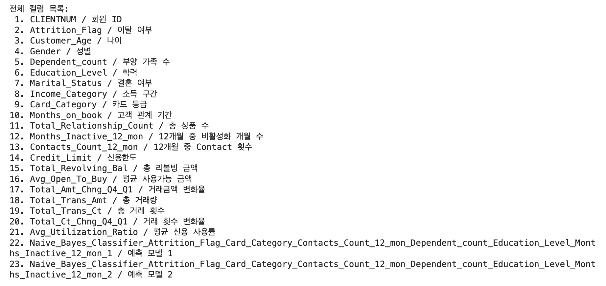
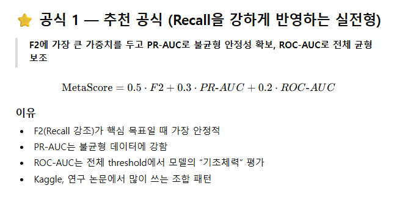
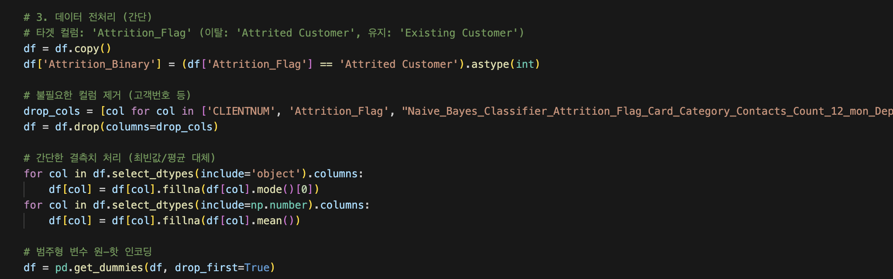
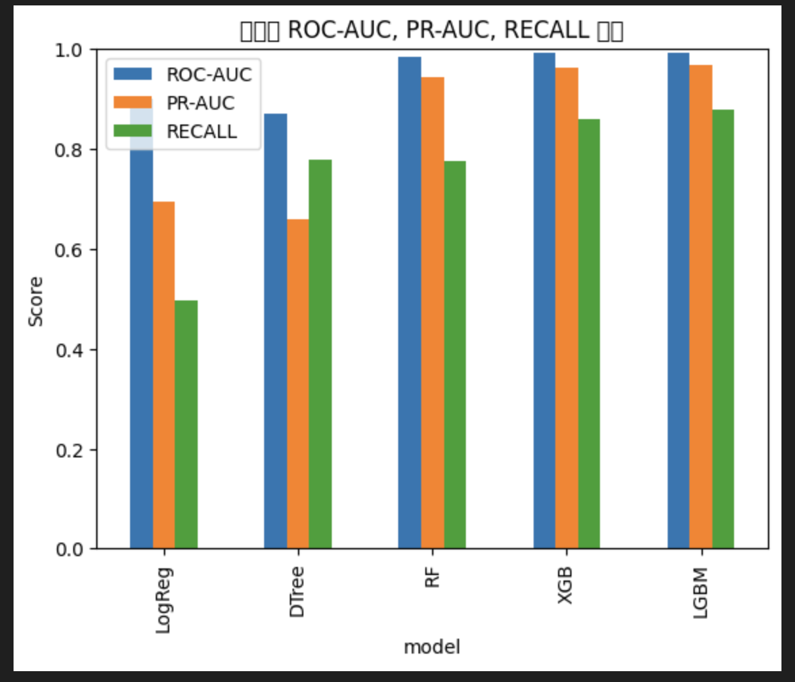
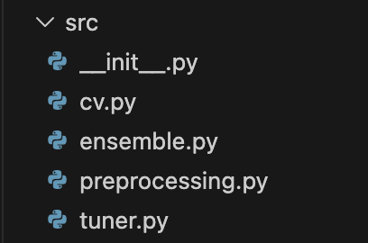
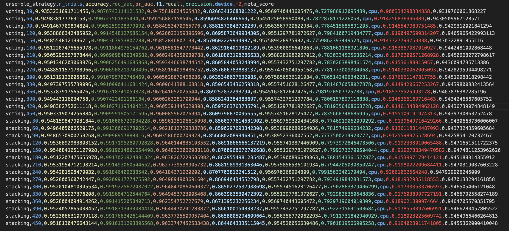
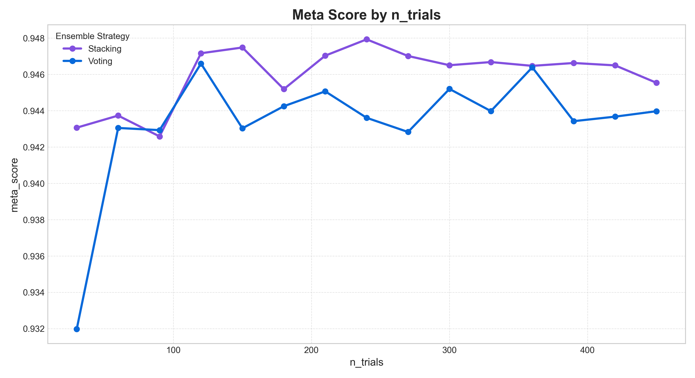

# 📘 프로젝트 README

## 1️⃣ 팀원 및 담당 업무

| #   | 팀원   | 담당 업무                                            | 비고 |
| --- | ------ | ---------------------------------------------------- | ---- |
| 1   | 김준석 | 모듈화, 하이퍼파라미터 튜닝, 파이프라이닝, Streamlit UI 구현             |   👑  |
| 2   | 문지영 |  Feature Engineering, 앙상블 전략, Streamlit UI 구현     |      |
| 3   | 신병탁 | CV 전략 확립·모델 실험, Streamlit UI 구현               |      |
| 4   | 이명준 | 모델 실험, 모델 평가, CI, QA                               |      |
| 5   | 손현우 | Feature Engineering, Streamlit UI 구현              |      |

---

## 2️⃣ 프로젝트 주제 및 선정 이유

### 2‑1. 주제

> “Credit Card사 고객 이탈(Churn) 예측”

### 2‑2. 주제를 선택한 이유

- **비즈니스 가치** – 이탈 고객을 사전에 파악해 맞춤형 마케팅/유지 전략을 수립할 수 있음.
- **데이터 가용성** – Kaggle에 풍부한 데이터가 존재(1만여명의 데이터).
- **기술 학습 목표** – Tuning, 앙상블 등 최신 ML 기법을 실전 프로젝트에 적용하고자 함.

---

## 3️⃣ 주요 기능

- **이탈 확률 예측** – 입력된 고객 정보(거래·인구통계)로 이탈 가능성을 실시간 예측.
- **이탈 예방 리텐션 마케팅(Streamlit)** – 이탈 위험도에 따라 각 회원의 이용 패턴에 최적화된 피드백 및 메시지발송

---

## 4️⃣ 프로젝트 디렉터리·파일 구조

```
skn-2nd-3team/
├─ .gitignore
├─ README.md
├─ requirements.txt
├─ main.py                       ← 프로젝트 진입점
├─ data/
│   └─ BankChurners.csv          # 원본 CSV 등
├─ src/
│   ├─ preprocessing.py          # 전처리 파이프라인
│   ├─ cv.py                     # Cross‑validation utils
│   ├─ ensemble.py               # 앙상블 로직
│   └─ tuner.py                  # 튜닝 로직
├─ results/
│   ├─ Final_Model/
│   │   └─ final_model.joblib    # 최종 모델
│   ├─ Preprocessing/
│   │   └─ README.md
│   ├─ Modeling/
│   │   └─ README.md
│   └─ streamlit/
│       ├─ main.py
│       ├─ dashboard.py
│       └─ utils.py
```

---

## 5️⃣ 수집 데이터 설명

| 데이터명           | 출처                         | 주요 컬럼                                                                                                                                                              | 비고 |
|--------------------|------------------------------|------------------------------------------------------------------------------------------------------------------------------------------------------------------------|------|
| `BankChurners.csv` | Kaggle (Bank Customer Churn) | `Gender`, `Age`, `IncomeCategory`, `EducationLevel`, `CardCategory`, `MonthsOnBook`, `TotalTransactionCount`, `TotalTransactionAmount`, `Attrition_Flag` |      |



## 6️⃣ 개발 과정

### 6-1. EDA 및 전략 수립
**데이터 특성 파악, 평가지표 선정, CV 전략 결정**

1. **EDA 진행**: `results/Preprocessing/EDA.ipynb`를 통해 데이터 특성 분석
2. **평가지표 선정**: 비즈니스 목적과 데이터 불균형 고려
    - **FN (놓친 이탈 고객)**: 고객을 완전히 잃음 → **큰 손실** (중요)
    - **FP (잘못된 이탈 예측)**: 불필요한 프로모션 비용 → 상대적으로 작은 비용
    
3. **CV 전략 수립**: 과적합 방지 및 신뢰성 확보
    - *질문*: 타겟 데이터가 불균형한가? & 시계열 데이터인가?
    - *결정*: **Stratified K-Fold** 적용

### 6-2. 베이스라인 구축
**기본 전처리/FE 파이프라인 구축**

- 기본적인 인코딩 및 불필요한 컬럼 제거만 수행하는 **BASE PIPELINE** 제작


### 6-3. 모델 선택
**동일한 BasePipeline, CV 환경에서 여러 모델 비교 후 Top 3 선정**

- **선정 모델**: `LogReg`, `DTree`, `LGBM`, `XGBoost`, `RandomForest` → 최종 `LGBM`, `XGBoost`, `RandomForest` 선택

이때에도 평가Metric 을 최대한 통일하려함.


### 6-4. 모듈화
**전처리, FE, 앙상블 전략을 `.py` 파일로 구조화**



- **`cv.py`**: Simple Split, K-Fold, Stratified K-Fold 구현
- **`ensemble.py`**: Stacking, Voting 앙상블 기법 구현
- **`preprocessing.py`**: 결측치 처리, 스케일링, Feature Engineering (Add/Select) 구현
- **`tuner.py`**: Optuna, GridSearch, RandomSearch 구현

### 6-5. 체계적 실험
**각 전략 조합을 실험하며 결과 추적 (Seed 관리)**

- 🔗 [Notion 실험 로그 보러가기](https://www.notion.so/2-2b6153f6ee1280e5bec5d62110449c73?source=copy_link)
- **실험 파이프라인 순서**:
  `CV 전략` → `전처리` → `Feature Engineering` → `튜닝` → `앙상블 전략` 순으로 고정하며 최적화
- **실험 환경**: Random Seed `42` 고정


### 6-6. 최종 모델 확정
**가장 안정적이고 높은 성능의 모델/앙상블 조합 도출**

| 구분 | 최종 결정 내용 |
| :--- | :--- |
| **전처리** | 결측치 제거, 불필요 컬럼 제거 |
| **FE** | 거래 변화율, 비활동 리스크 스코어, 고객 참여도(Engagement Score), Utilization 위험 구간화 |
| **CV** | Stratified K-Fold |
| **튜닝** | Optuna (n_splits=240) |
| **앙상블** | **Stacking** (LGBM, XGB, RF → LogisticRegression) |

## 7️⃣ Application 주요 기능

### 7‑1 제공 기능

- **예측 버튼** – 현재 고객들의 이탈확률을 체크
- **이탈률에 따라 맞춤형 메시지 발송 서비스** - 자동으로 회원의 정보에 맞는 메시지가 발송됨.
- **회원별 피드백 추천 페이지** – 신용 사용률, 최근 거래 빈도, 거래횟수 등을 고려하여 더욱 디테일한 피드백 제공.

### 7‑2 기술 스택

- **백엔드**: Python, Ensemble, Optuna
- **프론트엔드**: Streamlit

---

## 8️⃣ 회고

### 8‑1 구현 중 발생한 문제 & 해결 방안

| 문제                       | 원인                                        | 해결 방법                                                   |
| -------------------------- | ------------------------------------------- | ----------------------------------------------------------- |
| 결측치·이상치 처리         | 일부 컬럼(`Education_Level` 등) 데이터 누락 | 평균/최빈값 대체 + 이상치 IQR 필터링                        |
| 클래스 불균형 (양성 16%)   | 데이터 자체 비율                            | `scale_pos_weight` 조정 + Stratified K‑Fold CV              |
| 평가 점수 확립                          | F1-SCORE, ROC-AUC, PR-AUC, RECALL 등 다양한 평가점수 존재                       | …                                                           |

### 8‑2 회고록

- **김준석**: "이번 프로젝트를 통해 ML 개발의 체계적인 프로세스를 체득할 수 있었습니다. 특히 EDA → 전처리 → Feature Engineering → 튜닝 → 앙상블 순으로 진행되는 파이프라인을 직접 구축하면서, 각 단계가 왜 필요한지 명확히 이해하게 되었습니다. 처음에는 CV 평가 확립을 언제 해야 할지, 실험을 어떻게 셋팅해야 할지 막연했지만, 팀원들과 함께 체계적으로 실험하며 최적의 조합을 찾아가는 과정에서 자연스럽게 전체 흐름이 머릿속에 각인되었습니다. 또한 모듈화 작업을 맡으면서 cv.py, ensemble.py, tuner.py를 구조화하는 경험을 통해, 혼자 작업할 때보다 팀원들과 역할을 나눠 협업하는 것이 훨씬 효율적이라는 것을 체감했습니다. 앞으로 특정 로직을 선택할때 그 근거를 더 명확히 하는것이 좋은 ML개발자가 될 수 있다 라는 말을 곱씹으며 임하도록 하겠습니다."
- **문지영**: "이번 이탈률 예측 프로젝트를 진행하면서, 단순히 모델을 학습시키는 것보다 데이터를 어떻게 다루고 설계하는지가 모델 성능에 더 큰 영향을 준다는 것을 느낄 수 있었습니다. 처음 모델을 학습시켰을 때는 클래스 불균형 문제가 나타났는데, 이를 해결하기 위해 모델 학습 시 하이퍼파라미터인 'scale_pos_weight'를 활용해 이탈 고객에 더 높은 가중치를 부여함으로써 모델이 두 클래스를 균형 있게 학습할 수 있도록 개선했습니다. 단순히 원본 컬럼만 사용했을 때보다, 파생 변수를 추가한 후 모델의 표현력이 확실히 개선되는 경험을 했으며, 최적화된 단일 모델도 한계를 가질 수 있기에 서로 다른 오류 패턴을 가진 모델(LightGBM, Random Forest, Logistic Regression 등)을 조화롭게 결합한 앙상블을 통해 단순히 성능을 높이는 것을 넘어 예측 결과가 극단적으로 흔들리는 것을 방지하는 안정성을 확보할 수 있음을 체감했습니다. 이번 프로젝트를 하면서 기술적인 성과뿐 아니라, 팀원들이 방향을 잡아주고 함께 고민하며 진행한 덕분에 다양한 시도와 배움을 얻을 수 있다는 협업의 의미도 다시 한 번 느꼈습니다."
- **신병탁**: “??”
- **이명준**: “git을 통한 협업에 대해 얘기를 하던 도중, 시니어 개발자이신 팀원 분의 이야기를 통해 git을 통한 협업 방식을 구축하는 데에 있어 큰 관심이 생겼고, 작은 기능의 구현보다 단위 프로젝트가 나아가야할 방향성에 대한 생각을 하고 중심을 잃지 않으려고 노력하며 프로젝트를 진행했습니다. 또한, 프로젝트 상에서 역할 분배에 미흡한 부분이 있는지를 능동적으로 확인하고, 해당 부분을 메꿔가며 팀원 분들이 진행중인 workflow에 필요하지 않은 부분이 없는지 확인하며 진행했습니다. 이를 통해 기술적인 관점에서 agent를 이용해 프로젝트를 진행을 한다면 충분히 혼자서도 할 수 있지만, 각자의 분야에서 agent를 사용하며 강점을 살리는 협업을 통한 워크플로우의 중요성을 더 크게 실감했습니다.”
- **손현우**: "이번 Feature Engineering 분야에 있으면서, 그 과정에 있어서 데이터를 정리하고 꼼꼼히 하나하나 분석하며 나아가는 것에 대한 중요성을 배웠습니다. 또한 Streamlit으로 통하여 비즈니스 서비스 제안에 있어서, Feature 기반을 더 확률성이 확실한것으로 만들어 나가는 것이 중효하다는 것을 느꼈습니다. EDA로 통하여 코드 직접지었을때, 데이터 분석을 깔짝해서 코드를 만들수 있는게 아니라, 코드하나라도 실용성이 있어요 modeling 쪽으로 인수인계를 할때 발랜스가 수월하며, 데이터값도 거희 호환성이 높은 값을 제공하는것이 통계분석에 있어 중요하다는 점을 다시한번 깨달았습니다. 
