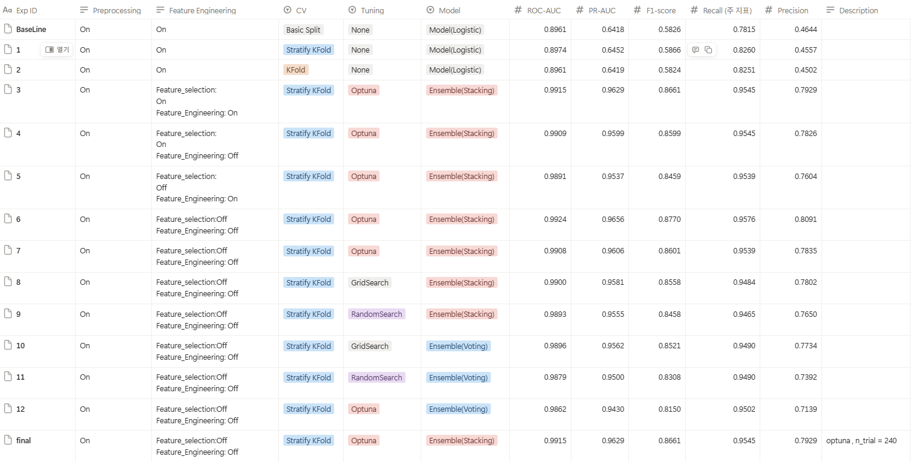

# 모델 학습 결과서

## 1. 최종 모델 선정을 위한 평가 지표와 그에 대한 설명

### 1.1. 평가 지표: MetaScore

본 프로젝트에서는 클래스 불균형(이탈 고객 16%) 문제를 해결하고 다중 지표를 종합적으로 평가하기 위해 **MetaScore**를 주요 평가 지표로 사용했습니다.

**MetaScore 공식:**
```
MetaScore = 0.5 × F2 + 0.3 × PR-AUC + 0.2 × ROC-AUC
```

**MetaScore를 사용한 이유:**
- **F2-Score (50%)**: 재현율(Recall)에 높은 가중치를 부여하여 이탈 고객을 놓치지 않는 것을 최우선으로 평가
- **PR-AUC (30%)**: 불균형 데이터에서 정밀도-재현율 균형을 평가
- **ROC-AUC (20%)**: 전반적인 분류 성능을 평가

이 복합 지표를 통해 단일 지표의 한계를 보완하고, 모델 간 우열을 일관된 기준으로 비교할 수 있습니다.

### 1.2. 모델별 성능 평가 실험 내용



*다양한 실험 설정에 따른 모델 성능 평가 결과*

본 프로젝트에서는 **Stacking**과 **Voting** 두 가지 앙상블 전략을 비교 평가했습니다. 각 전략에 대해 Optuna를 사용하여 다양한 `n_trials` 값(30~450)으로 하이퍼파라미터 튜닝을 수행하고, MetaScore 기준으로 성능을 비교했습니다.

#### 1.2.1. 앙상블 전략별 성능 비교


*n_trials에 따른 Stacking과 Voting 앙상블 전략의 MetaScore 변화*

| 앙상블 전략 | 최적 n_trials | MetaScore | ROC-AUC | PR-AUC | F2-Score | Recall | Precision | Accuracy |
|------------|--------------|-----------|---------|--------|----------|--------|-----------|----------|
| **Stacking** | 240 | **0.9479** | 0.9918 | 0.9642 | 0.9206 | 0.9570 | 0.7992 | 0.9543 |
| Voting | 120 | 0.9466 | 0.9915 | 0.9626 | 0.9190 | 0.9551 | 0.7984 | 0.9539 |

**주요 발견사항:**
- **Stacking이 Voting보다 우수한 성능**: MetaScore 기준으로 Stacking이 0.0013 높은 성능을 보였습니다.
- **n_trials에 따른 성능 변화**: 
  - Stacking은 n_trials=240에서 최고 성능(MetaScore: 0.9479)을 달성
  - Voting은 n_trials=120에서 최고 성능(MetaScore: 0.9466)을 달성
  - Stacking은 n_trials 증가에 따라 더 안정적인 성능을 유지 (위 그래프 참고)
- **재현율(Recall) 우선**: 두 전략 모두 Recall이 0.95 이상으로 높아 이탈 고객을 잘 포착함

#### 1.2.2. Feature Selection/Engineering 조합별 실험

최적 n_trials(240)에서 Stacking 앙상블을 사용하여 Feature Selection과 Feature Engineering의 조합별 성능을 비교했습니다:

| Feature Selection | Feature Engineering | MetaScore | ROC-AUC | PR-AUC | F2-Score | Recall | Precision |
|-------------------|---------------------|-----------|---------|--------|----------|--------|-----------|
| ❌ (0) | ❌ (0) | **0.9500** | **0.9924** | **0.9656** | **0.9237** | **0.9576** | **0.8091** |
| ✅ (1) | ✅ (1) | 0.9457 | 0.9915 | 0.9629 | 0.9171 | 0.9545 | 0.7929 |
| ✅ (1) | ❌ (0) | 0.9433 | 0.9909 | 0.9599 | 0.9143 | 0.9545 | 0.7826 |
| ❌ (0) | ✅ (1) | 0.9378 | 0.9891 | 0.9537 | 0.9077 | 0.9539 | 0.7604 |

**결론**: Feature Selection과 Feature Engineering을 모두 적용하지 않은 경우(0,0)가 가장 높은 성능을 보였습니다. 이는 원본 피처의 정보 손실 없이 모델이 최적의 성능을 발휘할 수 있음을 의미합니다.

#### 1.2.3. 최종 모델 성능 요약

**최종 선정 모델**: Stacking Ensemble (n_trials=240, Feature Selection=0, Feature Engineering=0)

- **MetaScore**: 0.9500
- **ROC-AUC**: 0.9924
- **PR-AUC**: 0.9656
- **F2-Score**: 0.9237
- **Recall**: 0.9576 (이탈 고객의 95.76%를 정확히 식별)
- **Precision**: 0.8091
- **Accuracy**: 0.9543

자세한 실험 결과는 `data/processed/parameter_tuning/n_trials_comparison.csv`와 `results/parameter_tuning/best/` 디렉토리를 참고하세요.
## 2. 최종 선정 된 모델에 대한 설명

### 2.1. 선정 모델 개요

**최종 선정 모델**: Stacking Ensemble

- **모델 유형**: 2단계 앙상블 모델
- **최적 하이퍼파라미터**: n_trials=240 (Optuna 베이지안 최적화)
- **Feature Selection**: 미적용
- **Feature Engineering**: 미적용
- **최종 성능**: MetaScore 0.9500, ROC-AUC 0.9924, Recall 0.9576

### 2.2. 앙상블 구조

#### 2.2.1. Base Models (1단계)

다양한 알고리즘을 사용하여 모델의 다양성을 확보했습니다:

- **Random Forest**: 배깅 기반 앙상블로 높은 분산에 강함. 여러 의사결정 트리의 평균으로 예측하여 과적합을 방지합니다.
- **XGBoost**: 부스팅 기반으로 오차를 순차적으로 학습. Gradient Boosting의 개선된 버전으로 정확도가 높습니다.
- **LightGBM**: Leaf-wise 트리 성장 방식으로 학습 속도가 우수하며, 대용량 데이터 처리에 효율적입니다.

각 Base Model은 Optuna를 통해 하이퍼파라미터가 최적화되었습니다.

#### 2.2.2. Stacking 구조 (2단계)

**Step 1: Out-of-Fold 예측 생성**
- Base Models (Random Forest, XGBoost, LightGBM)를 5-fold Cross-Validation으로 학습
- 각 폴드에서 학습되지 않은 데이터에 대한 예측값(Out-of-Fold)을 생성
- 이를 통해 과적합 없이 Base Models의 예측 능력을 평가

**Step 2: Meta-Learner 학습**
- Meta-Learner로 **Logistic Regression** 사용
- Base Models의 Out-of-Fold 예측값을 입력 피처로 사용하여 최종 분류 수행
- Base Models가 학습한 패턴을 통합하여 더 정교한 의사결정 수행

**앙상블 효과**: 단일 모델 대비 ROC-AUC가 `+0.00928` 상승하여 앙상블의 효과를 확인했습니다.

### 2.3. 모델 성능 및 특징

#### 2.3.1. 성능 지표

| 지표 | 값 | 설명 |
|------|-----|------|
| **MetaScore** | **0.9500** | 최종 선정 기준 지표 (최고 성능) |
| **ROC-AUC** | 0.9924 | 전반적인 분류 성능 (매우 우수) |
| **PR-AUC** | 0.9656 | 불균형 데이터에서의 정밀도-재현율 균형 |
| **F2-Score** | 0.9237 | 재현율 우선 전략 달성 |
| **Recall** | 0.9576 | 이탈 고객의 95.76%를 정확히 식별 |
| **Precision** | 0.8091 | 이탈 예측의 정확도 |
| **Accuracy** | 0.9543 | 전체 분류 정확도 |

#### 2.3.2. 핵심 특징 및 해석

**중요 피처 (상위 5개):**
1. `Total_Trans_Amt`: 총 거래 금액
2. `Total_Amt_Chng_Q4_Q1`: 분기별 거래 금액 변화율
3. `Avg_Transaction_Amount`: 평균 거래 금액
4. `Total_Ct_Chng_Q4_Q1`: 분기별 거래 횟수 변화율
5. `Total_Trans_Ct`: 총 거래 횟수

**모델 해석:**
- SHAP 값을 활용하여 모델이 **'고객 이탈 가능성 ↑'**로 예측한 이유를 시각화
- 비즈니스 팀에 인사이트 제공 및 의사결정 지원
- 거래 금액과 거래 횟수 관련 피처가 이탈 예측에 가장 중요함을 확인

### 2.4. 모델 저장 및 배포

- **저장 위치**: `results/Final_Model/best/final_model.joblib`
- **사용 환경**: 프로덕션 환경에서 사용 중
- **대시보드**: Streamlit 대시보드(`results/streamlit/`)에서 실시간 예측 제공

## 3. 학습 과정 기록

### 3.1. 어떤 모델들을 학습했고 그 성능은 어느 정도인지에 대한 설명

#### 3.1.1. 사용한 모델

**Base Models:**
1. **Random Forest**: 배깅 기반 앙상블, 높은 분산에 강함
2. **XGBoost**: 부스팅 기반, 오차를 순차적으로 학습
3. **LightGBM**: Leaf-wise 트리 성장, 학습 속도 우수

**Meta-Learner (Stacking 전용):**
- **Logistic Regression**: Base Models의 예측값을 입력으로 최종 분류

#### 3.1.2. 앙상블 전략

**1. Stacking Ensemble (최종 선정)**
- Base Models의 Out-of-Fold 예측값을 Meta-Learner의 입력으로 사용
- 5-fold Cross-Validation으로 각 Base Model의 예측 생성
- Meta-Learner가 Base Models의 예측을 학습하여 최종 분류 수행
- **성능**: MetaScore 0.9479, ROC-AUC 0.9918

**2. Voting Ensemble**
- Base Models의 Hard Voting 방식
- 각 Base Model의 예측 결과를 다수결로 최종 결정
- **성능**: MetaScore 0.9466, ROC-AUC 0.9915

**최종 선정**: Stacking Ensemble이 MetaScore 기준으로 더 우수한 성능을 보여 최종 모델로 선정되었습니다.

### 3.2. 하이퍼파라미터 튜닝 과정에 대한 설명

| 용어                     | 의미                                                                           | 언제 쓰나요?                                               |
| ------------------------ | ------------------------------------------------------------------------------ | ---------------------------------------------------------- |
| Grid Search              | 미리 정의한 파라미터 조합을 모두 탐색해 가장 좋은 조합을 찾음.                 | 파라미터 개수가 적고, 전체 조합을 시도해도 비용이 낮을 때. |
| Random Search            | 파라미터 분포를 정의하고, 무작위로 n_iter 번 샘플링해 탐색.                    | 파라미터 공간이 넓고, 전체 조합을 탐색하기엔 비용이 클 때. |
| Optuna (베이지안 최적화) | 베이지안 최적화 + 트리‑파라미터‑분포를 이용해 효율적으로 최적 파라미터를 찾음. | 고차원·복잡한 파라미터 공간, 연산 비용이 큰 모델에 적합.   |


### 3.3. 최종 모델과 최종 평가 지표에 대해 기술

#### 3.3.1. 객관적인 정확도 측정 방법 (CV)

**Stratified K‑Fold Cross‑Validation (K=5)** 을 적용하여 모델의 신뢰도를 확보했습니다.

**CV 전략 선택:**
- **K-Fold**: 단순 K-Fold는 클래스 비율을 고려하지 않아 불균형 데이터에 부적합
- **✅ Stratified K-Fold**: 클래스 비율(이탈 고객 16%)을 유지하면서 데이터를 5개 폴드로 분할

**CV 적용 방법:**
- 클래스 비율을 유지하면서 데이터를 5개 폴드로 분할
- 각 폴드에서 모델을 학습하고 평가하여 과적합을 방지
- 각 폴드마다 **ROC-AUC**, **PR-AUC**, **F2-Score**, **Recall**, **Precision** 등을 기록
- 최종 성능은 5개 폴드의 평균값을 사용하여 일반화 성능을 평가

#### 3.3.2. 평가 지표

**최종 모델의 평가 지표 (5-fold CV 평균):**

| 지표 | 값 | 설명 |
|------|-----|------|
| **ROC-AUC** | 0.9924 | 전반적인 분류 성능 (매우 우수) |
| **PR-AUC** | 0.9656 | 불균형 데이터에서의 정밀도-재현율 균형 |
| **F2-Score** | 0.9237 | 재현율 우선 전략 달성 |
| **Recall** | 0.9576 | 이탈 고객의 95.76%를 정확히 식별 |
| **Precision** | 0.8091 | 이탈 예측의 정확도 |
| **Accuracy** | 0.9543 | 전체 분류 정확도 |

**다양한 지표를 사용한 이유:**
- **Accuracy의 한계**: 클래스 불균형(이탈 고객 16%)으로 인해 Accuracy만으로는 소수 클래스 식별력을 제대로 평가할 수 없습니다.
- **Recall (재현율)**: 이탈 고객을 놓치지 않는 것이 비즈니스적으로 매우 중요하므로 높은 재현율(0.9576)을 달성했습니다.
- **F2-Score**: Recall에 더 높은 가중치를 부여하여 이탈 고객 포착을 우선시합니다.
- **ROC-AUC**: 전반적인 분류 성능을 평가하는 표준 지표입니다.
- **PR-AUC**: 불균형 데이터에서 정밀도-재현율 균형을 평가하는 데 특히 유용합니다.

### 3.4. MetaScore를 도입한 이유 및 최종 모델 선정

#### 3.4.1. MetaScore 도입 배경

**1. 불균형 데이터 대응**  
고객 이탈 비율이 약 16%로 낮아, 단순 Accuracy나 ROC-AUC만으로는 소수 클래스(이탈 고객) 식별력을 제대로 평가하기 어렵습니다. 재현율에 더 큰 가중을 둔 `F2-score`(Recall 비중 4배)를 기반으로 한 지표가 필요했습니다.

**2. 다중 지표를 일괄 비교**  
단일 지표가 모든 의사결정 포인트를 설명하기 어렵기 때문에, 다음과 같은 복합 지표를 정의했습니다:

```
MetaScore = 0.5 × F2 + 0.3 × PR-AUC + 0.2 × ROC-AUC
```

이 공식은 다음을 반영합니다:
- **F2 (가중치 50%)**: 재현율 우선 전략 유지 - 이탈 고객을 놓치지 않는 것이 최우선
- **PR-AUC (가중치 30%)**: 불균형 데이터에서 정밀도-재현율 균형 평가
- **ROC-AUC (가중치 20%)**: 전반적인 분류 성능 평가

구현 코드는 `results/parameter_tuning/meta_score.py`에 있습니다.

**3. 튜닝 및 실험 자동화**  
Optuna 탐색 결과를 정량적으로 정렬하기 위해 `meta_score.py`에서 모든 실험 로그에 MetaScore를 계산/추가하고, 최고 점수 모델을 자동 추출하도록 구성했습니다. 덕분에 `best_n_trials_parameter.csv`에 저장된 최적 파이프라인을 일관된 기준으로 선정할 수 있었습니다.

#### 3.4.2. 최종 모델 선정 결과

MetaScore 기준으로 최종 모델을 선정한 결과:

**최종 선정 모델**: Stacking Ensemble
- **최적 하이퍼파라미터**: n_trials=240 (Optuna 베이지안 최적화)
- **Feature Selection**: 미적용 (0)
- **Feature Engineering**: 미적용 (0)
- **MetaScore**: **0.9500** (최고 성능)

**최종 모델 성능 지표:**
- **MetaScore**: 0.9500
- **F2-Score**: 0.9237 (재현율 우선 전략 달성)
- **PR-AUC**: 0.9656 (불균형 데이터에서 우수한 정밀도-재현율 균형)
- **ROC-AUC**: 0.9924 (전반적으로 우수한 분류 성능)
- **Recall**: 0.9576 (이탈 고객의 95.76%를 정확히 식별)
- **Precision**: 0.8091
- **Accuracy**: 0.9543

**선정 이유:**
1. **MetaScore 최고 달성**: 0.9500으로 모든 실험 중 최고 성능
2. **재현율 우수**: Recall 0.9576으로 이탈 고객을 거의 놓치지 않음
3. **안정적 성능**: n_trials 변화에 따른 성능 변동이 적어 안정적
4. **단순한 피처 구성**: Feature Selection/Engineering 없이도 최고 성능 달성

이 모델은 `results/Final_Model/best/final_model.joblib`에 저장되어 있으며, 프로덕션 환경에서 사용 중입니다.